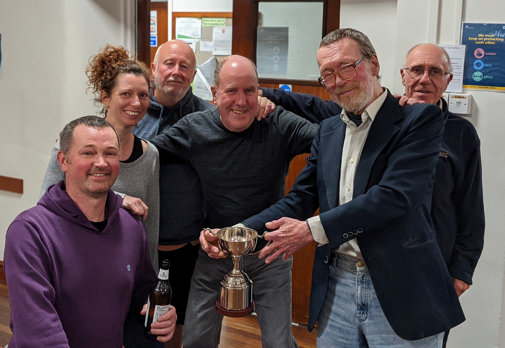
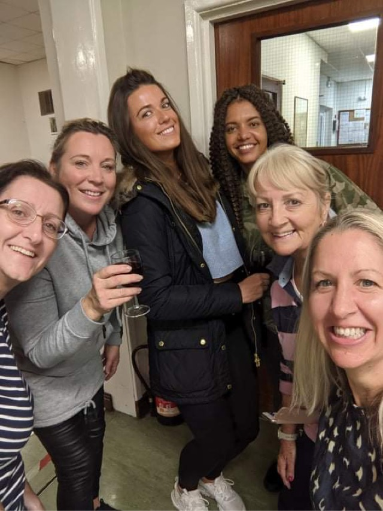
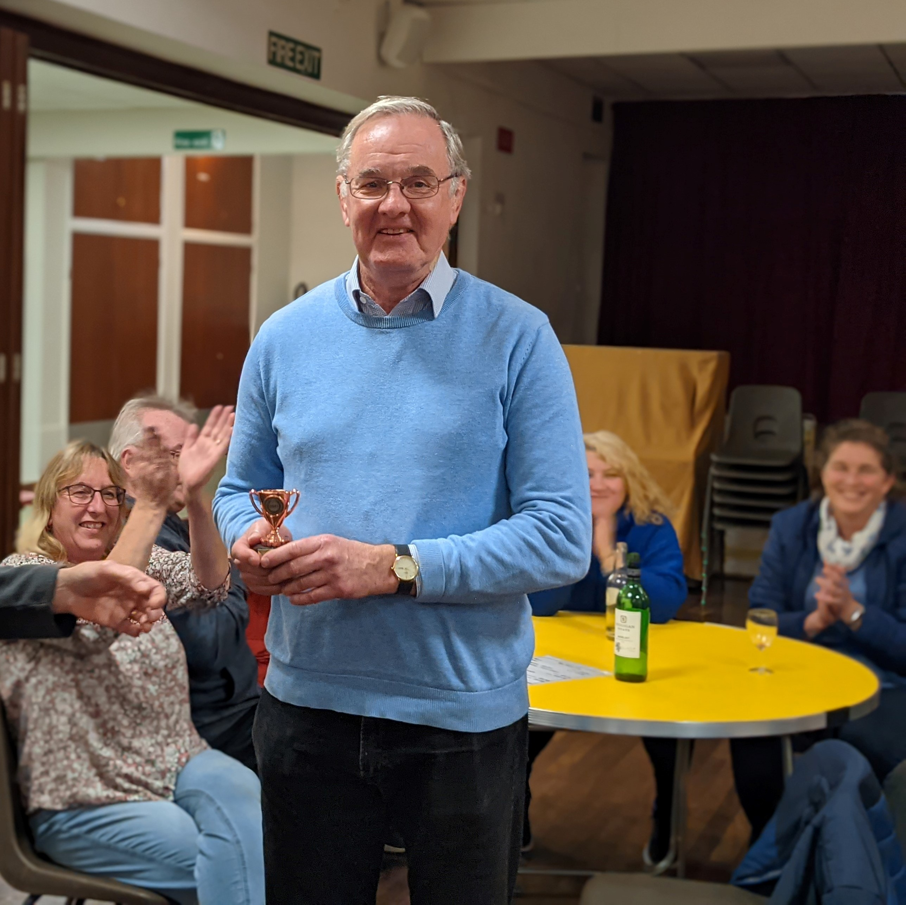

**HOLT VILLAGE HALL ANNUAL SKITTLES TOURNAMENT 2021**

Holt Village Hall was pleased to welcome 16 teams to the annual skittles tournament including three completely new teams: The Bowl Movements, Holt Lions and The Gamers and all were truly impressed with how much fun they had and are looking forward to the next tournament.

A mixture of old and new teams made it through to the quarter finals.

The semi-finalist consisted of Holt Morris, The Doggers (last year’s winners) Holt Drama and Booze Buddies

The final was between Holt Morris and Booze Buddies with Booze Buddies captained by Keith Moore being the ultimate winners of the competition .

This year to spread the glory, Holt Village Hall presented two additional awards:

Winner of the highest 3 balls in the preliminary round was won by Anisha Clarke playing for ‘Holt Lions’who commented “it was a brilliant experience, especially as I hadn’t played before”

Winner of the highest 9 balls in the preliminary round was won by Andy Hews playing for ‘The Doggers’

**Photos:** 

Sam Liverton, Steph Carr, Paul Barratt, Steve Uncles, Keith Moore (Capt.) and John Darby of the Booze Buddies celebrating their win

Holt Lions celebrating Anisha Clarke’s winning award for highest 3balls in the preliminary round 

Andy Hews receiving his award for highest 9 balls in the preliminary round 

