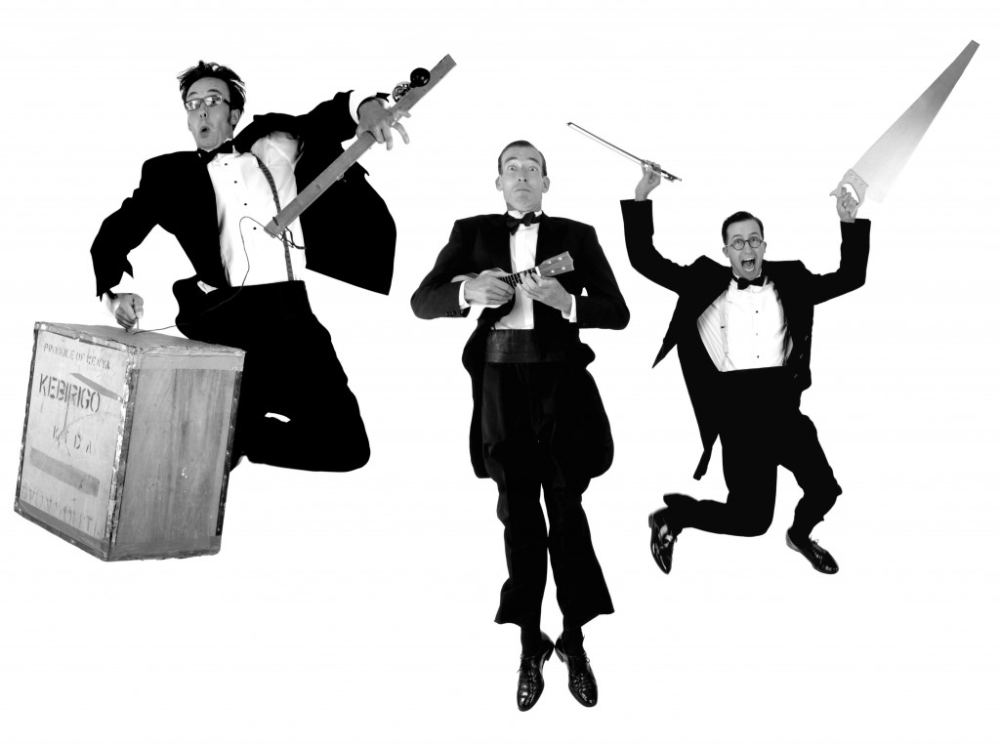

Holt Village Hall hosts the Hot Potato Syncopators - a comedy swing whoopee band featuring a brace of ukuleles, musical saw and tea-chest bass played by three eccentric English gentlemen.

<!-- end -->

## Hot Potato Syncopators

Straight from the golden era of the roaring twenties, these distinguished gentlemen present a musical revue of jazz and dance band melodies interspersed with visual gags, delightful humour and novelty moments.

[Hot Potato Syncopators](http://tiptopchaps.com/)

Since 1927\* these cat-swinging jazz hounds have been delighting audiences with galloping ukulele, tea chest bass, virtuosic musical saw and charming harmony singing. Absolutely top-hole entertainment!

\*not actually true.

`youtube:https://www.youtube.com/embed/6LL8F5f4KyY`

The band comprises of ukulele, tea-chest bass and musical saw, comedy moments, stage theatricals, acts of ear and eye defying balancing, bangs bells hooters and pop guns.

The funniest Jazziest act you'll ever see.
