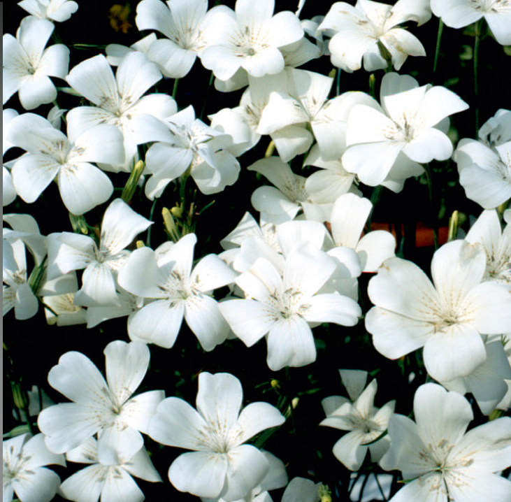
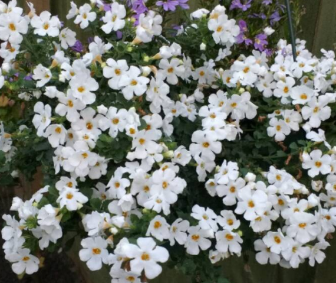
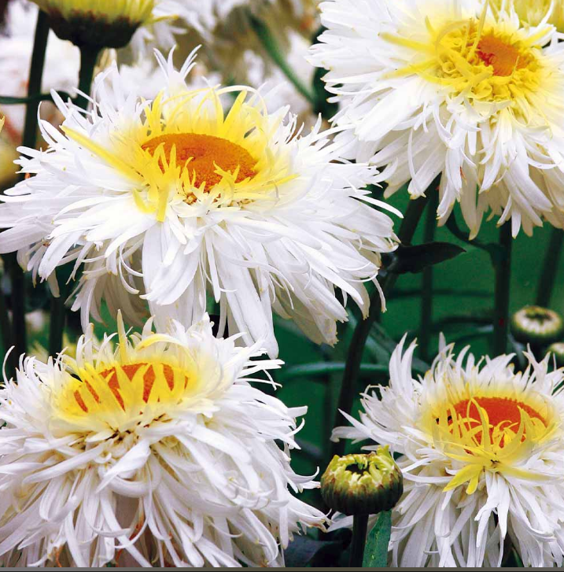
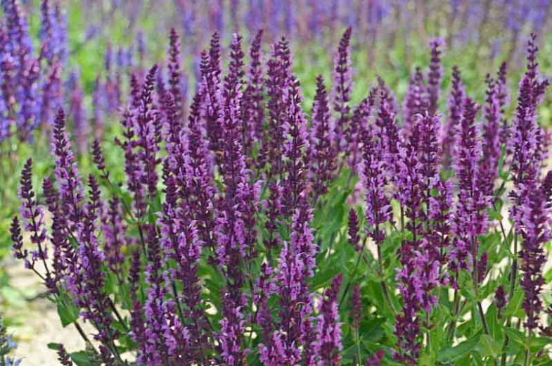
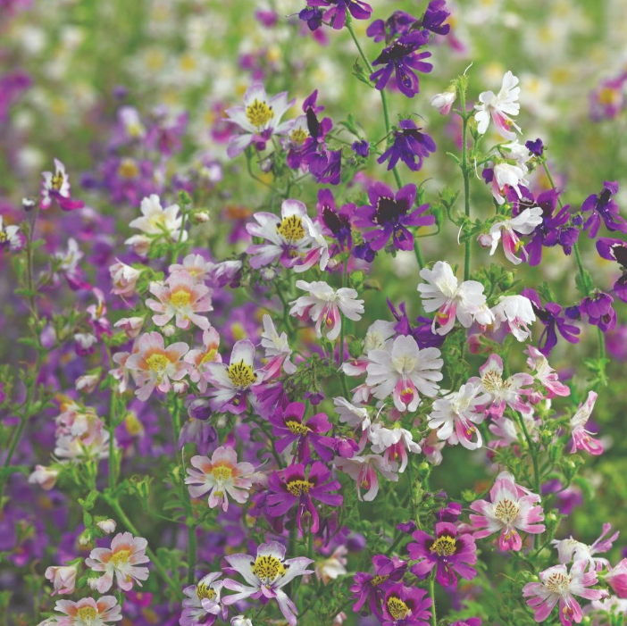

Come along and support the **VILLAGE HALL PLANT SALE** which is offering a wide variety of Bedding Plants, Perennials, Vegetables, Herbs and Tomatoes in aid of Village Hall funds.  

This is an outside event to be held at **11 Great Parks** (we cannot use the Village Hall due to Covid 19 restrictions) and will take pace on Saturday 8th May (or Saturday 15th if raining). 

Pre-order from Jo Hopkins at ***2tjhopkins@gmail.com*** to avoid disappointment.

**BEDDING AND PERENNIALS**

AGROSTEMMA *Snowqueen* 

ALYSSUM

AUBRIETA *Cascade Red*

BACOPA *Snowtopia* 

BEGONIA

BLACK EYED SUSAN

CALENDULA

COSMOS *White*

COSMOS *Red stripe*

EHCINACEA *Brilliant star*

FRENCH MARIGOLD

FUCHSIA *Various colours*

GERANIUMRED

GERANIUM *White*

GERANIUM *Trailing*

GYPSOPHILA *Covent Garden white*

HOLLYHOCK *Cabaret*

LAVATERA *Trimatera white*

LAVENDER

LEUCANTHEMUM *Crazy Daisy* 

LIVINGSTONE DAISY

LOBELIA *white/Crystal Palace /monsoon*

LUPIN *mixed*

MORNING GLORY *Heavenly Blue*

NASTURTIUM *Bloody Mary*

NEMESIA *Carnival mixed*

NICOTIANA

PETUNIA *mixed*

RHUDBECKIA

SALVIA *Horminum* 

SALVIA *Euphoria* 

SCHIZANTHUS *Angel Wings*  

SURFINA *trailing various colours*

VERBENA *mixed*

ZINNIA Faberge *mixed*

ZINNIA *Purple Prince|*

**HERBS AND VEGETABLES**

BASIL

BROAD BEANS

CAULIFLOWER

CHILLI *de cayenne hot*

CHIVES

CLIMBING FRENCH BEANS

CORIANDER

COURGETTE *green*

COURGETTE *yellow*

CUCUMBER *Telegraph*

CUCUMBER *Beth Alpha*

CUCUMBER *Nimrod*

FENNEL *bronze*

LEEKS

MINT

OREGANO

PARSLEY *curled leaf*

PARSLEY *flat leaf*

PEPPER *Chilli Demon red*

PURPLE SPROUTING

ROSEMARY

RUNNER BEAN

SPINACH

SWEET PEPPER

TARRAGON

THYME

**TOMATOES** 

ALICANTE 

COSTOLUTO FLORENTINO

GARDENERS DELIGHT 

MONEYMAKER

TUMBLING TOM

**PLANT PRICE LIST**

**Bedding Plant Strips (3 or 4 plants) -**£1.50

Begonia, Busy lizzie, Petunia, Lobelia, French Marigold, Cosmos, Zinnia, Verbena, Artic Poppy, Mornng Glory, Livingston Daisy, Blackeyed Susan ,Schizanthus,Zinnia

**Bedding Plant Single Plant Pots**

Geranium Upright - £2.50

Geranium Trailing - £2.00

FuchsiaTrailing - £ 2.50

Surfina Trailing - £ 2.50

BacopaTrailing - £3.00

**Other Annuals**

Single pots - £2.00

Trays /Strips - £1.50 - £2.00

**Vegetables**

Runner Beans (approx. 20) - £5.00

Runner Beans (6-8) - £2.00

Climbing French beans (6-8) - £1.50

Broad beans (6) - £1.00

Courgette - £1.00

Cucumber - £1.00

Peppers - £1.00

Purple sprouting - £1.00

Leeks - £1.00

**Herbs**- £1.00

Chives, Thyme, Coriander, Fennel, Parsley, Rosemary, Mint, Oregano, Tarragon, Basil

**Tomatoes**- £1.00

Money Maker, Gardeners Delight, Tumbling Tom, Alicante, Costoluto Florentino

**Perennials**

Gaura (the bride) - £3.00

Rudbeckia - £2.00

Lavender - £3.00

Echanacea - £2.50

Hollyhock - £2.00

**Other Perennials**

£2.00 - £3.00